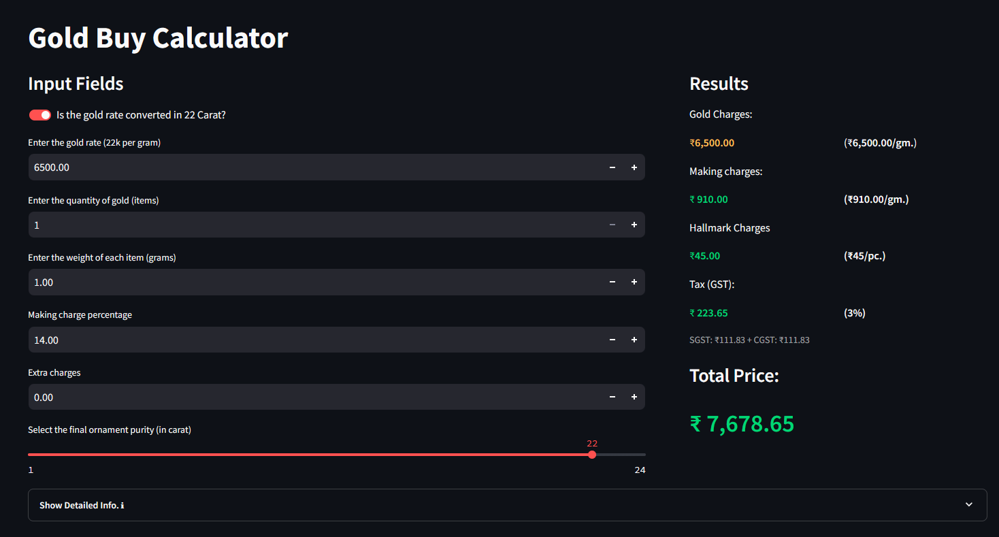
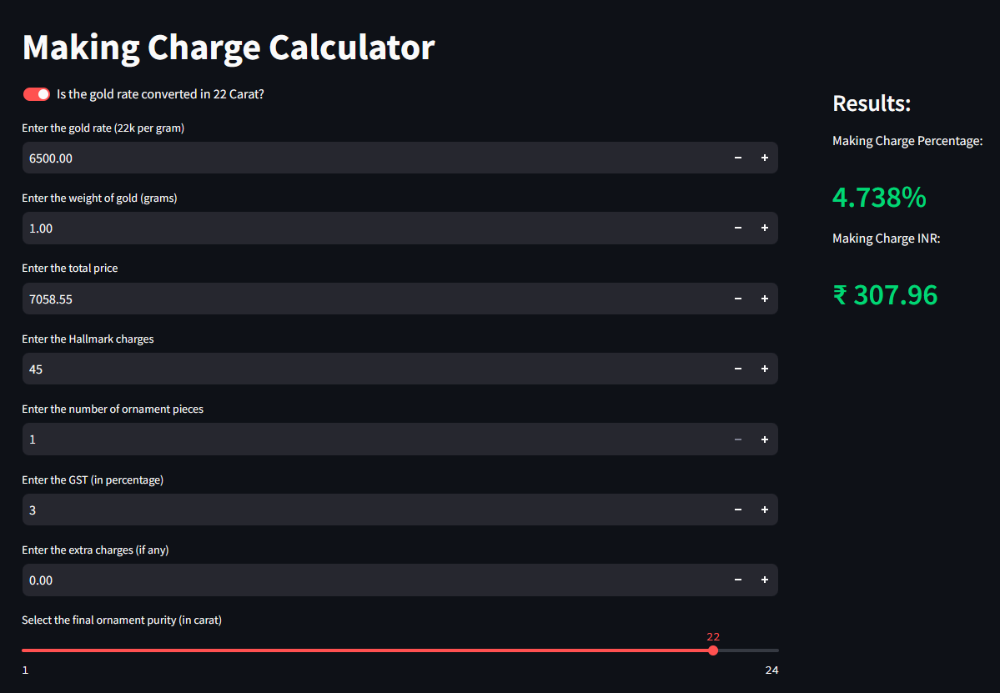
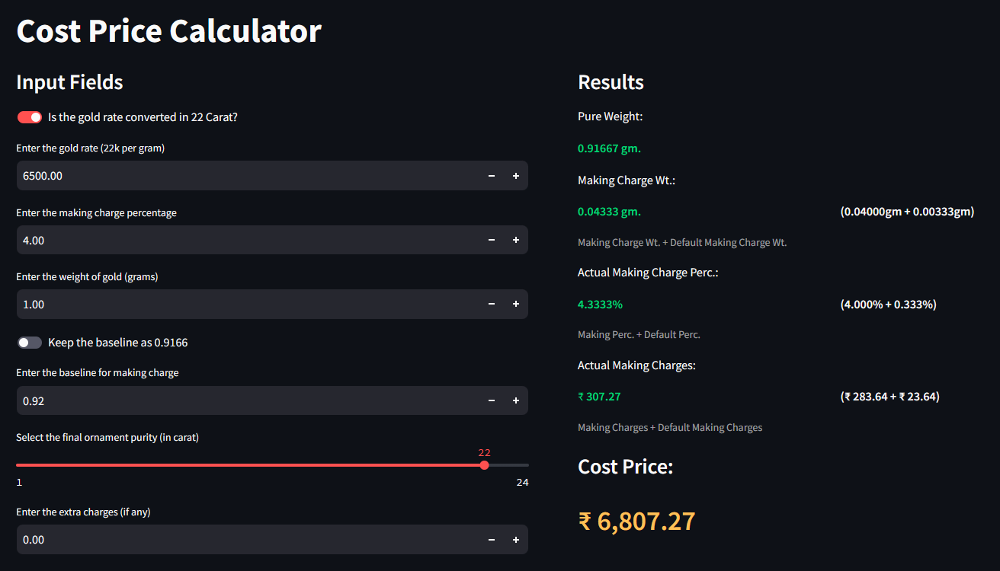

# ✨ Gold Business App

**Welcome to the Gold Calculator, your one-stop solution for all your gold purchasing or selling needs!**

## What can this app do?

- **Gold Price Calculator**:
Get the **exact selling price** of your gold ornaments with a **full breakdown of charges**. No more hidden fees or surprise markups.

- **Making Charges Calculator**:
Calculate the making charges based on the **rate**, **weight** and **purity**.

- **Cost Price Calculator** (for Business Owner):
Easily calculate the cost price of the gold and the payment to be made to the goldsmith. **Streamline your transactions** and **eliminate hassles**.

## Benefits

- 🔍**Transparent Pricing**: Understand the breakdown of charges.
- 💰**Save Money**: Don't pay more than you should.
- ⌛**Save Time**: No more manual calculations or guesswork.

## Future Enhancements

- [ ] **Automated Gold & Silver Rates**
- [ ] **Silver Ornament Calculatorr**
- [ ] **Gemstone Calculator**

> [!NOTE]
> This app was created for billing purposes for Rakshit & Co. Johuree, a gold and diamond jewellery store in Kolkata, India.
> Visit the FB page .